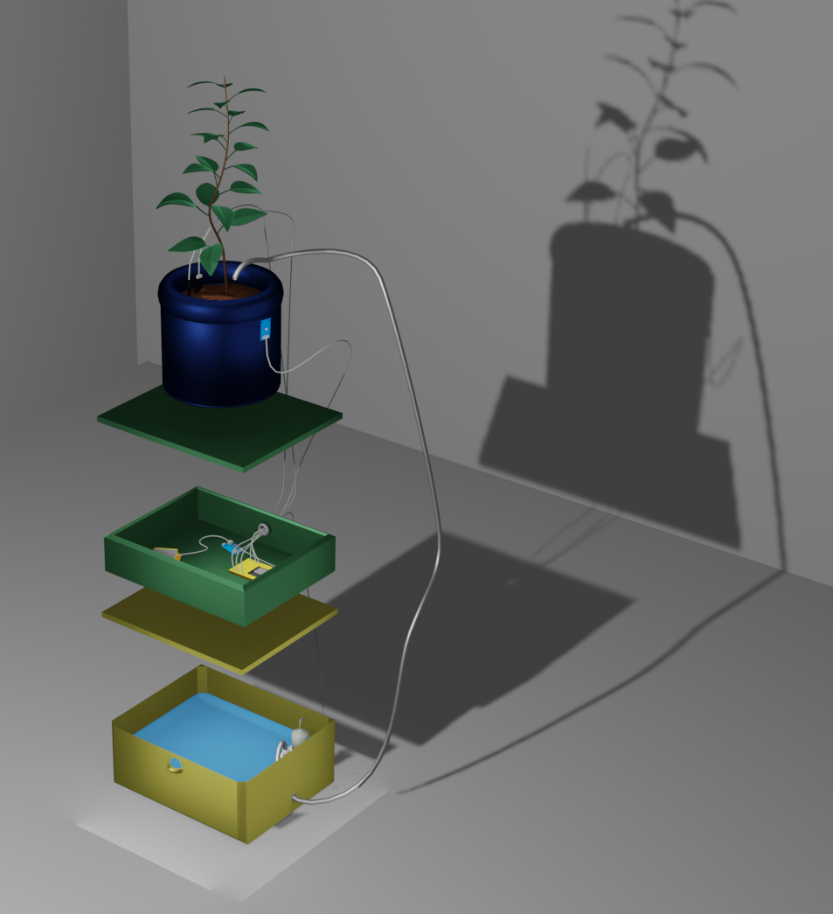
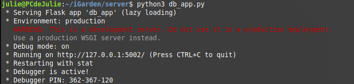
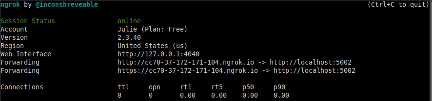
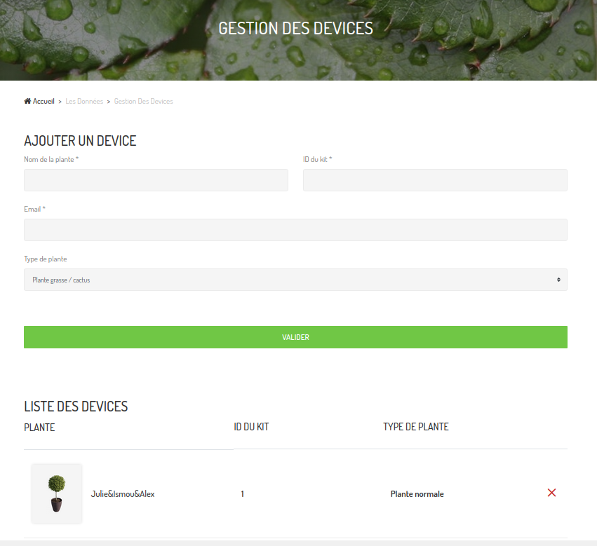

# iGarden

<div id="top"></div>
<!--
*** Thanks for checking out the Best-README-Template. If you have a suggestion
*** that would make this better, please fork the repo and create a pull request
*** or simply open an issue with the tag "enhancement".
*** Don't forget to give the project a star!
*** Thanks again! Now go create something AMAZING! :D
-->


<!-- PROJECT SHIELDS -->
<!--
*** I'm using markdown "reference style" links for readability.
*** Reference links are enclosed in brackets [ ] instead of parentheses ( ).
*** See the bottom of this document for the declaration of the reference variables
*** for contributors-url, forks-url, etc. This is an optional, concise syntax you may use.
*** https://www.markdownguide.org/basic-syntax/#reference-style-links
-->

<!-- PROJECT LOGO -->
<br />
<div align="center">
  <a href="https://github.com/ADEAC256/iGarden">
    
  </a>

<h3 align="center">iGarden</h3>

  <p align="center">
    Quand une fleur ne fleurit pas, on corrige l'environnement dans lequel elle pousse. Pas la fleur.
    <br />
    <a href="https://github.com/ADEAC256/iGarden"><strong>Explore the docs »</strong></a>
    <br />
    <br />
  </p>
</div>


<!-- TABLE OF CONTENTS -->
<details>
  <summary>Table of Contents</summary>
  <ol>
    <li>
      <a href="#propos">A propos du projet</a>
    </li>
    <li>
      <a href="#start">Getting Started</a>
      <ul>
        <li><a href="#material">Materiel</a></li>
        <li><a href="#requis">Pre-requis</a></li>
        <li><a href="#installation">Installation</a></li>
        <li><a href="#file">Fichier</a></li>
      </ul>
    </li>
    <li>
      <a href="#schema">Schema des architectures</a>
      <ul>
        <li><a href="#hard">Architecture hardware</a></li>
        <li><a href="#soft">Architecture software</a></li>
      </ul>
    </li>
     <li>
      <a href="#usage">Usage</a>
      <ul>
        <li><a href="#serveur">Serveur</a></li>
        <li><a href="#systeme">Système</a></li>
        <li><a href="#site">Site internet</a></li>
      </ul>
    </li>
    <li>
      <a href="#tools">Outils</a>
      <ul>
        <li><a href="#arduino">Software du système réalisé sur</a></li>
        <li><a href="#flask">Serveur réalisé avec</a></li>
        <li><a href="#bootstrap">Site internet réalisé avec</a></li>
      </ul>
    </li>
    <li>
      <a href="#contact">Contact</a>
      <ul>
        <li><a href="#team">Equipe</a></li>
      </ul>
    </li>
  </ol>
</details>

<!-- ABOUT THE PROJECT -->
## <a name="propos"></a> A propos du projet

<div align="center">
 <a href="https://github.com/ADEAC256/iGarden">
    
  </a>
 </div>
 <br>

Le projet iGarden a été conçu dans le cadre du module “Projet Objets Connectés” par trois élèves : Ismail BENNIS, Alexandra DEAC et Julie RAGO, élèves ingénieurs en EISE (Electronique et Informatique des Systèmes Embarqués) à Polytech Sorbonne.  

Ce projet est né de la problématique liée au manque de connaissances lorsque l’on souhaite avoir une plante d’intérieur chez soi. En effet, il n’est pas toujours facile, pour une personne débutante, de penser à arroser ses plantes au bon moment, de connaître la quantité d’eau requise, ou bien de savoir si la plante est placée au bon endroit. 

Notre solution, iGarden, consisterait donc en un système permettant : 
* La collecte de données sur l’environnement de la plante (température et humidité dans le sol et dans l’air, luminosité)
* La mise à disposition de ces données sur une interface en ligne
* L’arrosage automatique des plantes à distance.


<p align="right">(<a href="#top">back to top</a>)</p>

<!-- GETTING STARTED -->
## <a name="start"></a> Getting Started

Pour reproduire le système iGarden chez vous, le matériel et logiciels suivants sont nécessaire :

### <a name="material"></a> Matériel 

* Pour récupérer les données sur l’environnement de la plante :
  + [ESP32](https://www.gotronic.fr/art-module-nodemcu-esp32-28407.htm)
  + [DHT22](https://www.gotronic.fr/art-capteur-de-t-et-d-humidite-dht22-20719.htm)
  + [DS18B20](https://www.gotronic.fr/art-sonde-etanche-ds18b20-19339.htm)
  + [Soil Moisture Sensor](https://tinydb.readthedocs.io/en/latest/gla)
  + [TSL2561](https://learn.adafruit.com/tsl2561)
  
* Pour l’arrosage autonome de la plante :
  * [HC-SR04](https://www.gotronic.fr/art-module-de-detection-us-hc-sr04-20912.htm)
  * [GoTronic PM3V](https://www.gotronic.fr/art-pompe-miniature-submersible-pm3v-32875.htm)
  * [Adafruit Relay](https://www.adafruit.com/product/3191)


### <a name="requis"></a> Pré-requis

Pour pouvoir utiliser flask, vous aurez besoin d'installer virtualenv. Virtualenv aide un utilisateur à créer plusieurs environnements Python côte à côte . Ainsi, il peut éviter les problèmes de compatibilité entre les différentes versions des bibliothèques. Cette commande nécessite des privilèges d'administrateur. 
* virtualenv
  ```sh
  sudo pip3 install virtualenv 
  ```

### <a name="installation"></a> Installation

1. Cloner le repository
   ```sh
   git clone https://github.com/ADEAC256/iGarden.git
   ```
2. Installer flask
   ```sh
   pip3 install Flask
   ```
3. Installer flask_cors
   ```sh
   pip3 install -U flask-cors
   ```
3. Installer flask_mail
   ```sh
   pip3 install Flask-Mail
   ```
4. Installer TinyDB
   ```sh
   pip3 install tinydb
   ```

### <a name="file"></a> Fichiers 

- `hardware` contient le code du système à flasher sur l'ESP32
 
- `server` contient le software du serveur et la base de données.
 
- `website` contient tous les fichiers du site web.
 
- `documentation` contient la documentation (schema hardware, software, notice d'utilisation)

<p align="right">(<a href="#top">back to top</a>)</p>

<!-- ROADMAP -->
## <a name="schema"></a> Schéma des architectures 

### <a name="hard"></a> Architecture hardware
<br />
<div align="center">
  <a href="https://github.com/ADEAC256/iGarden">
    
  </a>
</div>
<br />
Voici ci-dessus le schéma de câblage à réaliser sur breadboard pour votre système iGarden. 

Celui-ci prend en compte l'alimentation du microcontrôleur, l’implémentation des différents capteurs, ainsi qu’un écran LCD permettant l’affichage d’informations importantes.

### <a name="soft"></a> Architecture software

<br />
<div align="center">
  <a href="https://github.com/ADEAC256/iGarden">
    
  </a>
</div>
<br />
Dans un premier temps, l’utilisateur devra s’enregistrer sur le site, et il devra renseigner par la même occasion le type de plante qu’il possède. 

Ces informations seront reçues par le serveur qui va les enregistrer dans sa base de données, puis il retournera à l’ESP32 le type de plante pour qu’ensuite le microcontrôleur puisse analyser correctement les valeurs perçues par les capteurs en fonction des besoins de la plante. 

Les valeurs mesurées seront retournées à l’utilisateur et enregistrées par l’intermédiaire du serveur et de sa base de données. 

Concernant le protocole de communication, nous avons fait le choix d’implémenter un serveur <b>RESTful</b> qui manipule des données au format <b>JSON</b>.

Une communication typique se déroule de la manière suivante : 
<br />
<div align="center">
  <a href="https://github.com/ADEAC256/iGarden">
    
  </a>
</div>
<br />
Nous avons le système ESP32 qui va perpétuellement envoyer au serveur une requête GET en attendant de recevoir un id de plante ainsi que son type correspondant. 

Une fois ces informations fournies par l’utilisateur via le site web, le système se mettra ensuite à envoyer de manière régulière les données récoltées par ses capteurs. 

<p align="right">(<a href="#top">back to top</a>)</p>

<!-- USAGE EXAMPLES -->
## <a name="usage"></a> Usage

Dans cette partie figureront les instructions pour lancer les différents éléments constituant le système iGarden.

### <a name="serveur"></a> Serveur 
Comment lancer le serveur + ngrok + parler des alertes email
Pour lancer le serveur, il suffit d’exécuter la commande suivante dans le répertoire où se situent les codes disponibles dans le dossier server : <br>
```sh
python3 db_app.py
```
<br>
L’exécution devrait rendre l’affichage suivant dans le terminal :
<br><br>
<div align="center">
 <a href="https://github.com/ADEAC256/iGarden">
    
  </a>
 </div>
<br><br>
Comme on peut le voir à la dernière ligne de code de ce script python, le serveur sera lancé en localhost, sur le port 5002 (le numéro de port peut être modifiable). 
<br>
<br>
On utilise ensuite sur un autre terminal en parallèle l’outil ngrok, qui permet de créer un tunnel depuis le localhost vers une URL publique accessible pour les autres parties du système global : 
<br><br>
<div align="center">
 <a href="https://github.com/ADEAC256/iGarden">
    
  </a>
 </div>
<br><br>
Celui-ci affiche donc l’adresse URL à renseigner pour le côté système et le côté website.

### <a name="systeme"></a> Systeme 
<br>
Du côté système, dans le dossier hardware du git se trouve le fichier .ino du code à flasher sur l’ESP32. Pour mettre le code sur un microcontrolleur, nous vous conseillons d'utiliser une IDE [Arduino](https://www.arduino.cc/).
<br> <br>
Avant de flasher le code sur la carte, il faut penser à mettre à jour certaines informations :
  * Puisque nous utilisons le module WiFi de l’ESP32 pour communiquer avec le serveur, il est nécessaire de renseigner le SSID (nom de réseau) ainsi que le mot de passe du réseau WiFi où vous souhaitez installer iGarden (lignes 19 et 20 du code).
  * C’est aussi à ce moment que l’on met à jour l’URL d’accès au serveur (lignes 316 et 320).

### <a name="site"></a> Site internet 
<br>
Ici aussi nous devons mettre à jour le lien ngrok dans le dossier website aux endroits suivants : 

  * Dans le fichier app.py, à la ligne 82,
  * Dans le fichier checkout.html, aux lignes 308 et 357

Il suffit ensuite de lancer l’application de la même manière que le serveur : <br>
```sh
python3 app.py
```
<br>
Lorsque l’on se connecte sur un navigateur internet, on peut apercevoir l’affichage suivant pour enregistrer sa plante :
<br><br>
<div align="center">
 <a href="https://github.com/ADEAC256/iGarden">
    
  </a>
 </div> 
<br><br>
A partir d’un même compte utilisateur, il est possible de monitorer plusieurs plantes. 

Une fois la plante enregistrée, il est possible d’accéder au dashboard :
<br><br>
PHOTO 
<br><br>
<p align="right">(<a href="#top">back to top</a>)</p>

## <a name="tools"></a> Outils utilisés

### <a name="arduino"></a> Software du système réalisé sur
* [Arduino](https://www.arduino.cc/)

### <a name="flask"></a> Serveur construit avec

* [Flask](https://flask.palletsprojects.com/en/2.0.x/)
* [TinyDb](https://tinydb.readthedocs.io/en/latest/intro.html)

### <a name="bootstrap"></a> Site internet construit avec

* [Bootstrap](https://getbootstrap.com)
* [JQuery](https://jquery.com)

<p align="right">(<a href="#top">back to top</a>)</p>

<!-- CONTACT -->
## <a name="contact"></a> Contact

iGarden - igarden.eise@gmail.com
<br>
<br>
Project Link: [https://github.com/ADEAC256/iGarden](https://github.com/ADEAC256/iGarden)

### <a name="team"></a> Equipe : 
* Ismail BENNIS : [Linkedin](https://www.linkedin.com/in/ismail-bennis/)
* Alexandra DEAC : [Linkedin](https://www.linkedin.com/in/alexandra-deac/)
* Julie RAGO : [Linkedin](https://www.linkedin.com/in/julie-rago/)

<p align="right">(<a href="#top">back to top</a>)</p>


<!-- MARKDOWN LINKS & IMAGES -->
<!-- https://www.markdownguide.org/basic-syntax/#reference-style-links -->
[contributors-shield]: https://img.shields.io/github/contributors/github_username/repo_name.svg?style=for-the-badge
[contributors-url]: https://github.com/ADEAC256/iGarden/graphs/contributors
[forks-shield]: https://img.shields.io/github/forks/github_username/repo_name.svg?style=for-the-badge
[forks-url]: https://github.com/ADEAC256/iGarden/network/members
[stars-shield]: https://img.shields.io/github/stars/github_username/repo_name.svg?style=for-the-badge
[stars-url]: https://github.com/ADEAC256/iGarden/stargazers
[issues-shield]: https://img.shields.io/github/issues/github_username/repo_name.svg?style=for-the-badge
[issues-url]: https://github.com/ADEAC256/iGarden/issues
[license-shield]: https://img.shields.io/github/license/github_username/repo_name.svg?style=for-the-badge
[license-url]: https://github.com/ADEAC256/iGarden/blob/master/LICENSE.txt
[linkedin-shield]: https://img.shields.io/badge/-LinkedIn-black.svg?style=for-the-badge&logo=linkedin&colorB=555
[linkedin-url]: https://www.linkedin.com/in/ismail-bennis/
[linkedin-url1]: https://www.linkedin.com/in/alexandra-deac/
[linkedin-url2]: https://www.linkedin.com/in/julie-rago/
[product-screenshot]: images/screenshot.png
